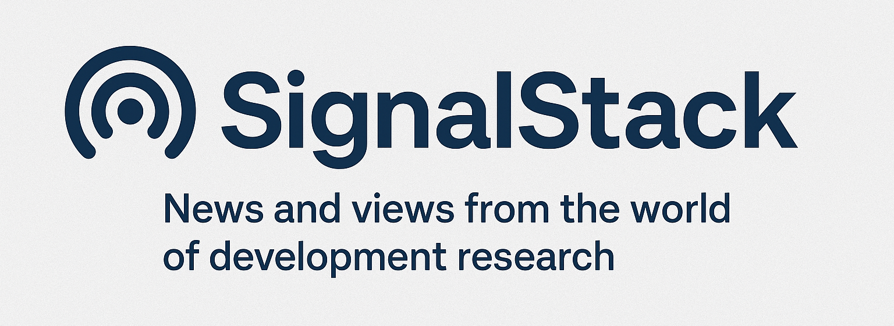

<p align="center">
  
</p>

<h1 align="center">SignalStack</h1>

<p align="center">
  <strong>The open knowledge base behind the <em>Research Rundown</em> newsletter.</strong><br>
  Curated reports, tools, and companion materials for development researchers and practitioners.
</p>

<p align="center">
  <a href="https://openstacks.dev"></a>
  <a href="LICENSE"></a>
  <a href="https://researchrundown.substack.com"></a>
  <a href="https://github.com/Varnasr/SignalStack/actions"></a>
</p>

---

## Why SignalStack Exists

Development research moves fast. Critical reports from WHO, FAO, IPCC, and ODI are published constantly, but they're scattered across dozens of institutional websites with no single place to find, compare, or contextualise them.

**SignalStack bridges that gap.** Each quarter, the [Research Rundown](https://researchrundown.substack.com) newsletter curates the most important new research — and this repository archives it all with summaries, source links, companion materials, and study resources that outlive any single newsletter issue.

This is the **knowledge curation layer** of [OpenStacks for Change](https://openstacks.dev) — an open ecosystem of tools for public interest research and evaluation.

---

## Quick Start

**Browse the content:**

- [Newsletter Issues](issues/) — Archived issues with summaries and key takeaways
- [Featured Tools](featured/) — Curated research tools and methods
- [Book Companions](extras/books/) — Study aids and concept guides
- [Extended Notes](extras/issue%20notes/) — Deep-dive source links and follow-up reading
- [Full Documentation](docs/) — How the project works, how to contribute, and what's planned

**Subscribe for updates:** [Research Rundown on Substack](https://researchrundown.substack.com)

---

## Newsletter Archive

Each issue is archived here with full summaries and key takeaways — not just links to Substack.

| Issue | Date | Themes | Highlights |
|-------|------|--------|------------|
| [Issue 2](issues/april-2025/) | Apr 2025 | Climate, Gender, Governance, Health | Gender-responsive climate resilience, WHO equity toolkit, BRICS+ governance shifts, visualising uncertainty |
| [Issue 1](issues/june-2024/) | Jun 2024 | Food, Climate, Gender, Methods, Open Science | SOFI global hunger report, IPCC synthesis, ocean gender equity, decolonising research, OpenAlex |

## Featured Resources

| Resource | Type | Description |
|----------|------|-------------|
| [AI Tools for Excel](featured/learning-generative-ai-tools-for-excel.md) | Tool Guide | Using Copilot, ChatGPT, and AI assistants to supercharge Excel workflows for researchers |
| [101 Data Science Drawings](extras/books/101_data_drawings_extras/) | Book Companion | Key concepts, applications, visual walkthroughs, and study resources for Raymond Lim's visual data science guide |
| [THR June Notes](extras/issue%20notes/notes-on-THR-june-edition.md) | Extended Notes | Source links and follow-up resources for gender-responsive climate resilience, health equity, BRICS+, and more |

---

## The OpenStacks Ecosystem

SignalStack is one of several open repositories in the [OpenStacks](https://openstacks.dev) ecosystem. Each stack serves a different purpose — SignalStack curates and highlights tools from the others.

```text
                          OpenStacks for Change
                    ________________________________
                   |                                |
    SignalStack ---+--- InsightStack --- FieldStack |
   (you are here)  |        |               |      |
                   |    EquityStack --------'      |
                   |________________________________|
```

| Stack | What It Does | Language |
|-------|-------------|----------|
| **[InsightStack](https://github.com/Varnasr/InsightStack)** | MEL tools, sample size calculators, documentation templates | JavaScript |
| **[FieldStack](https://github.com/Varnasr/FieldStack)** | R notebooks for fieldwork, surveys, and evaluation analysis | R |
| **[EquityStack](https://github.com/Varnasr/EquityStack)** | Python workflows for econometrics, causal inference, and development data | Python |
| **SignalStack** (this repo) | Research curation, newsletter archive, book companions | Markdown |

---

## Project Structure

```text
SignalStack/
├── issues/                    # Newsletter issue archives (with full summaries)
│   ├── april-2025/            #   Issue 2: Climate, gender, governance, health
│   └── june-2024/             #   Issue 1: Food security, climate, open science
├── featured/                  # Featured research tools and methods
├── extras/
│   ├── books/                 # Book companion materials
│   │   └── 101_data_drawings_extras/  # Concepts, applications, walkthroughs
│   └── issue notes/           # Extended newsletter references and source links
├── docs/                      # Project documentation (GitBook-style)
│   ├── README.md              #   Documentation home
│   ├── getting-started.md     #   Setup and orientation
│   ├── content-guide.md       #   How to read and use this repo
│   ├── architecture.md        #   How the project is structured
│   └── roadmap.md             #   What's planned next
├── assets/banner/             # Visual assets
├── .github/                   # CI/CD, issue templates, security policy
├── CONTRIBUTING.md            # How to contribute
├── CHANGELOG.md               # Auto-generated from commits
└── CITATION.cff               # How to cite this project
```

## Contributing

We welcome contributions — whether it's fixing a broken link, suggesting a resource, or adding content. See the [Contributing Guide](CONTRIBUTING.md) for commit conventions, setup instructions, and PR guidelines.

## Citation

If you reference this collection in academic or professional work:

```bibtex
@misc{signalstack,
  author = {Sri Raman, Varna},
  title = {SignalStack: Research Rundown Newsletter Archive and Curated Development Resources},
  year = {2024},
  url = {https://github.com/Varnasr/SignalStack},
  license = {MIT}
}
```

## License

MIT — free to use, modify, and share. See [LICENSE](LICENSE).

---

<p align="center">
  <strong>Created by <a href="https://github.com/Varnasr">Varna Sri Raman</a></strong> — Development Economist & Social Researcher<br>
  <a href="https://researchrundown.substack.com">Newsletter</a> · <a href="https://openstacks.dev">OpenStacks</a> · <a href="CONTRIBUTING.md">Contribute</a>
</p>
