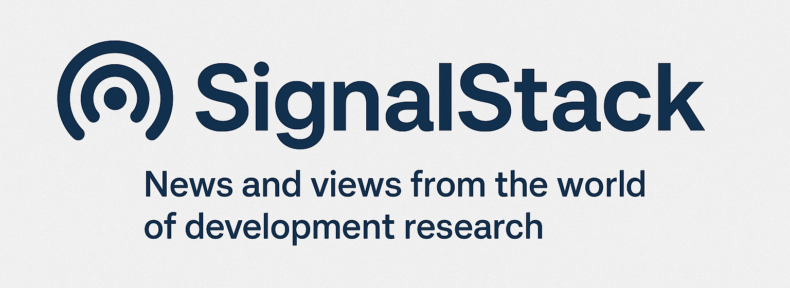

  

# SignalStack

**News and views from the world of development research.**

---

SignalStack is the living repository accompanying the [Research Rundown](https://varna.substack.com/) newsletter and the broader [OpenStacks](https://openstacks.dev/) open knowledge project.

✨ Stay updated on cutting-edge research methods, new tools, ethical dilemmas, and best practices in the evolving landscape of development research.

---

## 📚 What's Inside

- **/issues/** — Active links and summaries for each Research Rundown edition
- **/featured/** — Highlighted research tools and frameworks
- **/extras/** — Bonus notes, deep dives, and extended resources

---

## 📢 Latest Updates

- **June 2025:** Launch of SignalStack! 🚀  
- **Featured Resource:** [Learning Generative AI Tools for Excel](featured/learning-generative-ai-tools-for-excel.md)

---

## 🔥 Tags
`research` `development` `open-access` `ai-tools` `knowledge` `education`

---

### License

This repository is shared under the MIT License — see [LICENSE](LICENSE) for details.

---

> Stay tuned — more signals coming soon!
