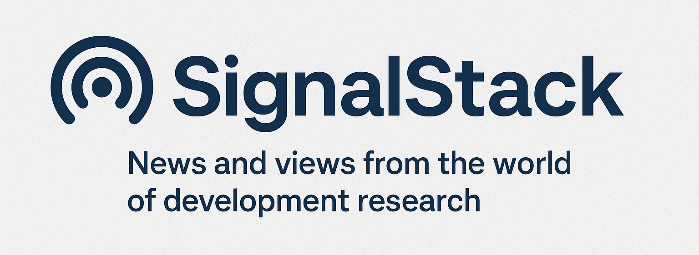

  

# 🚀 Welcome to SignalStack

**SignalStack** is the companion repository for the *Research Rundown* newsletter —  
bringing you curated insights, research resources, and updates from the world of development policy, social research, and climate resilience.

Explore:
- 📚 [Research Rundown Issues](./issues/)
- 🛠️ [Featured Tools and Resources](./resources/)
- 📬 [Subscribe to Research Rundown](https://open.substack.com/pub/varna)

---

## 📖 About Research Rundown

*Research Rundown* is a curated monthly update highlighting critical new reports, frameworks, data tools, and emerging debates in development research.  
Each issue features selected readings, toolkits, and visual storytelling to bridge knowledge to action.

---

## ✨ What's Inside SignalStack

- Full listing of *Research Rundown* issues
- Companion notes and links for featured items
- Curated tools and resources (coming soon)
- Updates and live links to external repositories and open resources

---

## 📬 Stay Connected

- 📖 [Subscribe to Research Rundown](https://open.substack.com/pub/varna)
- 🌐 [Explore OpenStacks.dev](https://openstacks.dev/)
- ✉️ Contact: varna.sr@gmail.com

---
